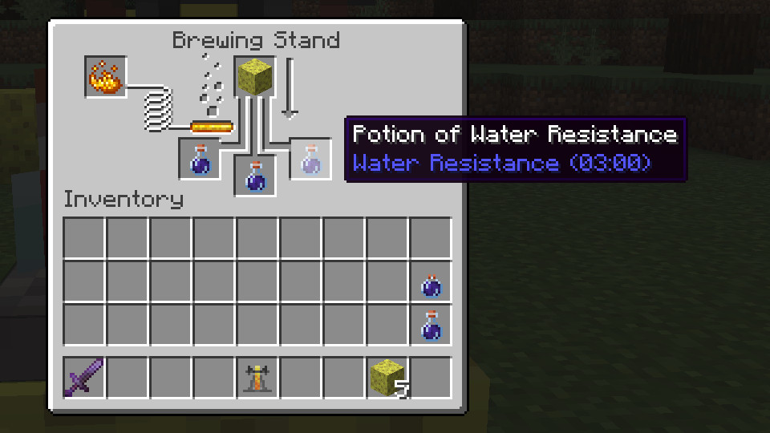

# Water Resistance Potion

A minecraft fabric mod that adds a potion of water resistance which gives the effect "water resistance"—negating water damage that isn't drowning.

In vanilla the only usecase for granting an entity water protection is to allow mobs that are hurt by water \(e.g. Endermen\) to swim in it without taking damage; however, if the [Origins](https://modrinth.com/mod/origins) mod is installed it will also protect the hydrophobic origins from water.

The potion allows this \(non-expansive\) list of entities to become immune to water damage:

* Enderman
* Blaze
* Players of an Origin with the "origins:water_vulnerability" power
  * [Blazeborn](https://origins.readthedocs.io/en/latest/misc/base_contents/origins/blazeborn/)
  * [Enderian](https://origins.readthedocs.io/en/latest/misc/base_contents/origins/enderian/)
  * Any other hydrophobic origin

Brewing recipe:

In a brewing stand, combine an awkward potion with a sponge. To make the potion last longer, add redstone.

The potions are commonly found in the loot of shipwrecks, sometimes in ancient cities, and rarely among other places.

The potion crafting recipe can be changed (to any item in the game) in the mods config file and/or in its modmenu entry.

## Supported Minecraft Versions

| Minecraft Version | Latest Mod Version                                                                        | Currently Supported |
|-------------------|-------------------------------------------------------------------------------------------|:-------------------:|
| 1.21.5            | [1.5.0+1.21.5](https://modrinth.com/mod/water-resistance-potion/version/1.5.0+1.21.5)     |          *          |
| 1.21.2-1.21.4     | [1.5.0+1.21.3](https://modrinth.com/mod/water-resistance-potion/version/1.5.0+1.21.3)     |          *          |
| 1.21-1.21.1       | [1.5.0](https://modrinth.com/mod/water-resistance-potion/version/1.5.0)                   |          *          |
| 1.19.3-1.20.4     | [1.3.0](https://modrinth.com/mod/water-resistance-potion/version/1.3.0)                   |          ✓          |
| 1.19.2            | [1.3.0+1.19.2](https://modrinth.com/mod/water-resistance-potion/version/1.3.0+1.19.2)     |          X          |

\* Support depends on which versions of Mincecraft Origins mod will target. (i.e. whichever version bracket is the highest and compatible with Origins mod)

Older builds for Minecraft versions 1.16, 1.17, and 1.18 are available on Modrinth. There's also a build for 1.20.6.

\* Open an [issue](https://codeberg.org/Alliegaytor/water-resistance-potion/issues/new) on codeberg or [github](https://github.com/Alliegaytor/water-resistance-potion) and I'll most likely update it, but don't expect complete and timely support

Note: PRs updating other versions are more than welcome.

## TODO
- [x] Add water resistance status effect to enchanted golden apples
- [ ] Teach Blazes how to swim? / Decide if it's a feature that they can't swim
- [ ] Error handling & debugging
- [ ] Add potions to loot tables of some modded structures
- [ ] Add support for popular Minecraft versions
  - [ ] 1.12.2 (ambitious)
  - [ ] 1.7.10 (very ambitious)
- [ ] Localisations

## Thanks <3
### To these lovely contributors
* [unroman](https://github.com/unroman) for Ukrainian translation

### Useful projects
Thanks to [Fallen_Breath](https://github.com/Fallen-Breath) for [conditional-mixin](https://github.com/Fallen-Breath/conditional-mixin/tree/master), allowing this mod to conditionally apply mixins.

[owo-lib](https://github.com/wisp-forest/owo-lib) for their nice simple config api.

## License
This project is licensed as [LGPL-3.0-only](./LICENSE).
