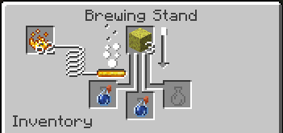

# Water Resistance Potion

A minecraft fabric mod that adds a potion of water resistance which gives the effect "water protection"—negating water damage that isn't drowning.

In vanilla the only usecase for granting an entity water protection is to allow mobs that are hurt by water \(e.g. Endermen\) to swim in it without taking damage; however, if the [Origins](https://modrinth.com/mod/origins) mod is installed it will also protect the hydrophobic origins from water.

The potion allows this \(non-expansive\) list of entities to become immune to water damage:

* Enderman
* Blaze
* Players of an Origin with the "origins:water_vulnerability" power
  * [Blazeborn](https://origins.readthedocs.io/en/latest/misc/base_contents/origins/blazeborn/)
  * [Enderian](https://origins.readthedocs.io/en/latest/misc/base_contents/origins/enderian/)
  * Any other hydrophobic origin

Brewing recipe:

In a brewing stand, combine an awkward potion with a sponge. To make the potion last longer, add redstone.

The potions are commonly found in the loot of shipwrecks, sometimes in ancient cities, and rarely among other places.

## Supported Minecraft Versions

| Minecraft Version | Latest Mod Version                                                                    | Currently Supported |
|-------------------|---------------------------------------------------------------------------------------|:-------------------:|
| 1.19.3–1.20.1     | [1.0.1+1.20.1](https://modrinth.com/mod/water-resistance-potion/version/1.0.1+1.20.1) |          ✓          |
| 1.19.2            | [1.0.1+1.19.2](https://modrinth.com/mod/water-resistance-potion/version/1.0.1+1.19.2) |          ✓          |
| 1.18.2            | [1.0.1+1.18.2](https://modrinth.com/mod/water-resistance-potion/version/1.0.1+1.18.2) |          ✓          |
| 1.17.0, 1.17.1    | [1.0.1+1.17.1](https://modrinth.com/mod/water-resistance-potion/version/1.0.1+1.17.1) |          ✓          |

## TODO
- [ ] Add water resistance status effect to enchanted golden apples
- [ ] Teach Blazes how to swim? / Decide if it's a feature that they can't swim
- [ ] Error handling & debugging
- [ ] Add potions to loot tables of some modded structures
- [ ] Add support for popular Minecraft versions
  - [ ] 1.16.5
  - [ ] 1.12.2 (ambitious)
  - [ ] 1.7.10 (very ambitious)
- [ ] Localisations
- [ ] Add potion texture, as the texture looks bad in 1.20

## Thanks <3
### To these lovely contributors
* [unroman](https://github.com/unroman) for Ukrainian translation

### Useful projects
Thanks to [Fallen_Breath](https://github.com/Fallen-Breath) for [conditional-mixin](https://github.com/Fallen-Breath/conditional-mixin/tree/master), allowing this mod to conditionally apply mixins.

## License
This project is licensed as [LGPL-3.0-only](./LICENSE).